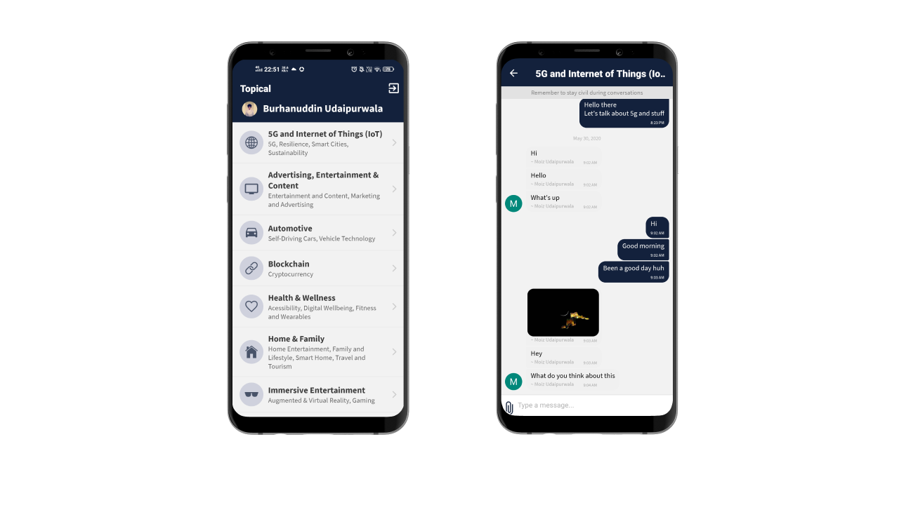

    

# Topical

Topical is a topic based chat application where users participate in conversations in large numbers

    

## Features

- Send links
- Ability to send photos
- Sign in via Google directly, no registration required

## Download

You can use Topical in any of the following methods:

- Download a compiled APK from the releases tab
- Use this expo URL to run the app on the expo client on your Android device - [Expo](https://expo.io/@burhanuday/topical-app)

## Build your own

- Install the expo cli `yarn add global expo-cli`
- Run the development server with `yarn android` for Android and `yarn ios` for iOS devices
- You will have to add your own firebase config file and enable firestore and firebase storage from the console

## Tech Stack

Topical is built with React Native and Firebase

## License

MIT
